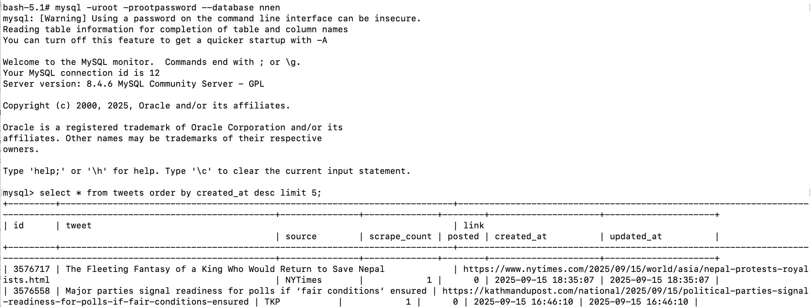

# nepal_news_en_data

All the news from Nepal in English language from 2021 to 2025 (mid Sep), the data for https://x.com/nepal_news_en

## How to run it with docker compose

1. Make sure you have docker and docker-compose installed

2. Run the following command in the terminal

    ```
    docker-compose up -d
    ```

3. The MySQL server will be running on port 3306 with news/tweets from Nepal in English language in the database `nnen` and table `tweets` with 192K+ rows.

4. Quick way to run your query would be:

```
docker compose exec mysql bash
```

5. Then inside the container, run:

```
mysql -uroot -prootpassword --database nnen
```

6. Then you can run your SQL queries like:

```
select count(*) from tweets;
```

Or

```
select * from tweets order by created_at desc limit 5;
```



7. You can use your SQL skills to find what you want. 

Enjoy!
